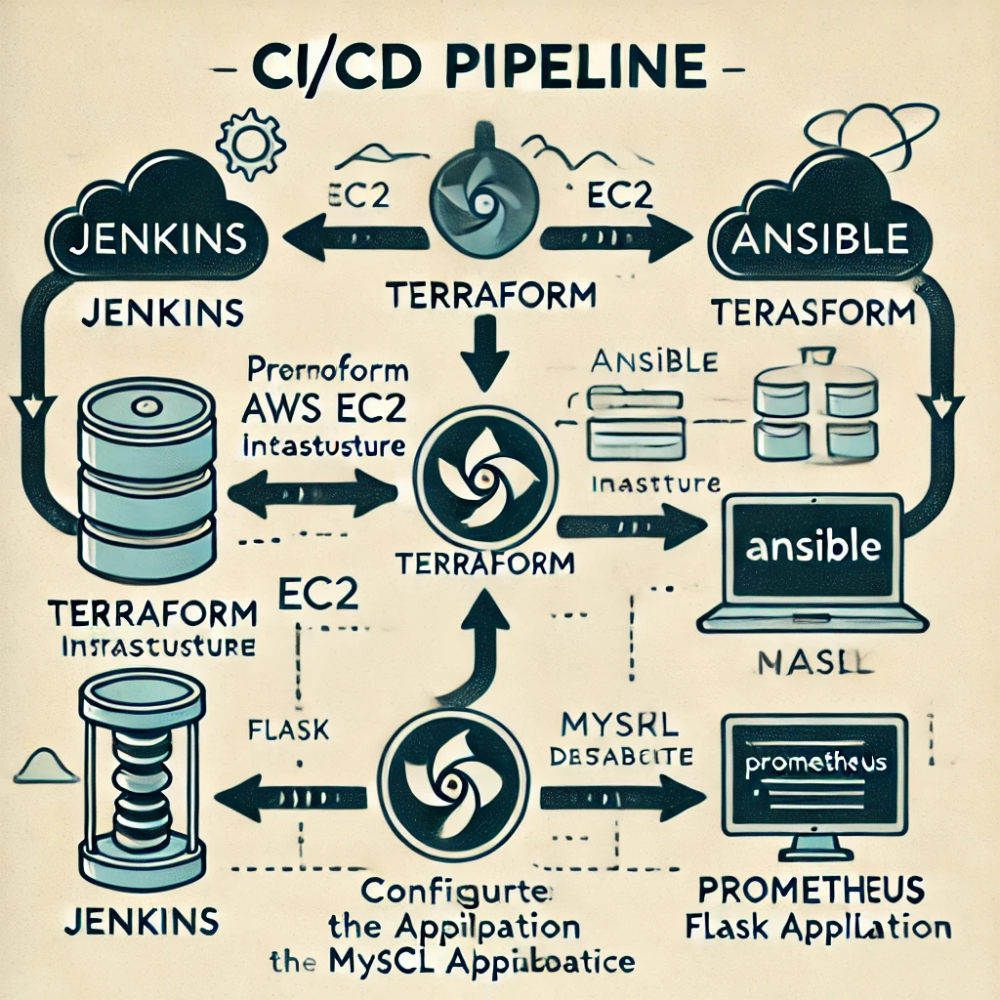

# Project-203: Automated Deployment of Python Flask Application on AWS EC2 Using Jenkins, Terraform, and Ansible

## Project Overview

This project demonstrates how to use Jenkins, Ansible, and Terraform to automate the deployment of a Python Flask Web API to AWS EC2. The application is integrated with a MySQL database, and Ansible manages the server configuration. Terraform is used to provision the AWS infrastructure.

The Jenkins pipeline automates the entire process, including creating the infrastructure, configuring the EC2 instance, and deploying the Python Flask application. The final result is a running Flask API accessible via the public IP address of the EC2 instance.

## Architecture Diagram



_This architecture diagram represents the entire process flow of how Jenkins, Terraform, and Ansible work together to deploy the Python Flask application on AWS._

## Project Flow:

1. **Terraform**:
   - Creates an EC2 instance on AWS.
   - Outputs the public IP of the EC2 instance dynamically.

2. **Jenkins**:
   - Triggers Terraform to provision the required AWS infrastructure.
   - Dynamically captures the public IP from Terraform's output and passes it to Ansible's `inventory.yml`.
   - Executes an Ansible playbook to configure the server and deploy the Flask application.

3. **Ansible**:
   - Installs required packages such as Python, MySQL, and Flask dependencies on the EC2 instance.
   - Configures the Flask application to run on the EC2 instance and connects it to the MySQL database.
   - Ensures that the Flask application is running and accessible via the public IP of the EC2 instance.

## Learning Outcomes

By completing this project, you will learn:

1. **Automated Infrastructure Provisioning with Terraform**:
   - How to write and use Terraform configurations to automatically create and manage AWS resources such as EC2 instances and security groups.
   - How to use Terraform output to dynamically retrieve EC2 public IP addresses for further configuration.

2. **CI/CD Pipeline with Jenkins**:
   - Setting up and configuring Jenkins to automate the entire CI/CD process.
   - Integrating Terraform and Ansible into a Jenkins pipeline to ensure a fully automated infrastructure and application deployment process.

3. **Server Configuration with Ansible**:
   - Writing Ansible playbooks to install necessary software and configure services like Python and MySQL on AWS EC2 instances.
   - Automating the deployment of Python Flask applications and ensuring that they are connected to a MySQL database and accessible via the public IP.

4. **Python Flask Application Deployment**:
   - How to build and deploy a Python Flask REST API, connect it to a MySQL database, and configure it to be accessible over the internet.


## Tools Used

This project leverages the following tools:

- **Jenkins**: A popular open-source automation server that facilitates continuous integration and continuous deployment (CI/CD). In this project, Jenkins is used to automate the entire deployment pipeline.
- **Terraform**: An infrastructure-as-code (IaC) tool that allows you to define, provision, and manage AWS infrastructure in a simple and declarative way.
- **Ansible**: A configuration management tool that automates the process of installing software, configuring servers, and deploying applications.
- **Python Flask**: A micro web framework used to develop the Bookstore API that connects to a MySQL database.
- **AWS EC2**: Amazon Elastic Compute Cloud (EC2) instances that are provisioned by Terraform to host the Flask application.
- **MySQL**: The relational database management system (RDBMS) used to store book data for the API.

## Setup and Deployment Instructions

### 1. Provision Infrastructure with Terraform

In the project directory, there is a Terraform configuration file (`main.tf`) that provisions the required EC2 instance on AWS.

```bash
# Initialize Terraform
terraform init

# Apply the Terraform configuration
terraform apply -auto-approve

2. Deploy the Application Using Jenkins Pipeline
The Jenkins pipeline automates the following steps:

Terraform provisions the EC2 instance and captures the public IP.
Jenkins dynamically adds the public IP to Ansible's inventory.
Ansible deploys the Flask application on the EC2 instance.
Once the Jenkins pipeline has completed, the Flask application will be running and accessible via the public IP address of the EC2 instance.

3. Ansible Playbook for Application Deployment
Ansible is responsible for the following tasks:

Installing Python 3 and MySQL server on the EC2 instance.
Installing Flask and other required Python packages (from requirements.txt).
Deploying the Flask application and configuring it to connect to the MySQL database.
Project File Structure
The following files should be present in the project directory:

203-jenkins-ansible-bookstore-api-on-python-flask-mysql (folder)
|
|---- readme.md            # Project description
|---- bookstore-api.py     # Python Flask Web API (main application)
|---- requirements.txt     # List of Flask modules and dependencies
|---- main.tf              # Terraform configuration file
|---- deploy-bookstore.yml # Ansible playbook for deploying the application
|---- inventory.yml        # Ansible inventory file (generated dynamically by Jenkins)

What Will You Learn?
Terraform: Automate the creation of AWS infrastructure using Terraform's infrastructure-as-code (IaC) capabilities.
Jenkins: Create a fully automated CI/CD pipeline that provisions infrastructure, configures servers, and deploys applications.
Ansible: Learn how to write playbooks to automate the installation of software and configuration of servers.
Python Flask: Develop and deploy a simple RESTful API in Python using Flask, integrated with a MySQL database.

Conclusion
By completing this project, you will gain hands-on experience in automating infrastructure provisioning, server configuration, and application deployment using industry-standard tools such as Jenkins, Terraform, and Ansible.
